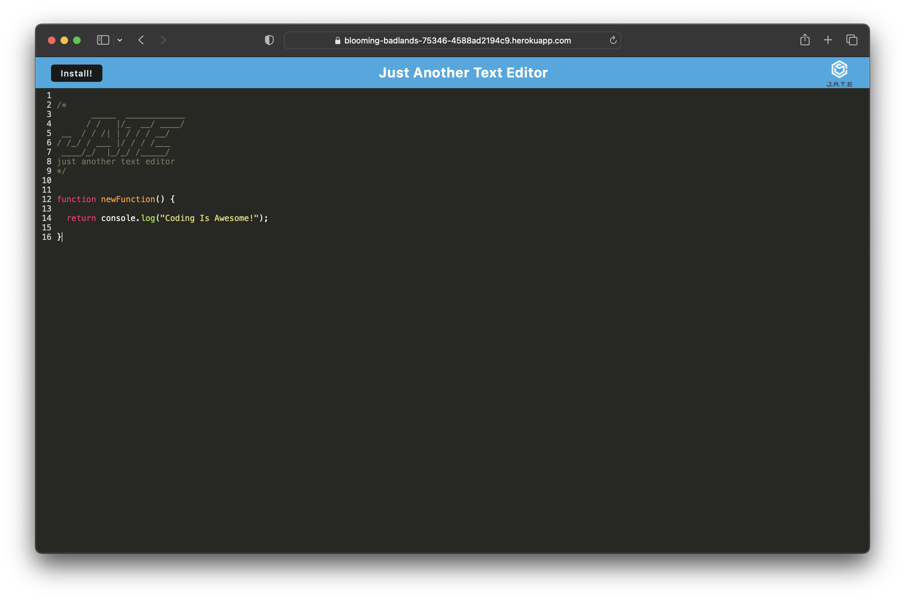

# JATE-A-PWA-Text-Editor

## Description

JATE is a project developed to provide developers with a reliable way to create and store notes or code snippets, whether they are connected to the internet or not. The motivation behind this project is to address the need for a tool that allows developers to capture their ideas, code snippets, and thoughts without worrying about an internet connection, and to have these resources readily accessible for future use.

The project focuses on providing a seamless user experience by incorporating technologies like IndexedDB for local storage, webpack for bundling JavaScript files, service workers for offline functionality, and a client-server architecture for organizing and serving content.

## Table of Contents

- [Installation](#installation)
- [Usage](#usage)
- [Features](#features)
- [Credits](#credits)
- [License](#license)

## Installation

To set up the development environment and run the project locally, follow these steps:

1. Clone the repository to your local machine.
2. Navigate to the project directory.
3. Install the required dependencies by using `npm install`.
4. Build the application by running `npm run build`.
5. Start the backend server and client application with `npm run start:dev`.
6. Open your web browser and access the application at `http://localhost:3000`.

## Usage

Once the environment is set up, simply click on the editor area and begin typing, this is where you can write your notes or code snippets.
When you're done using the application, you can simply close the browser.

## Features

- IndexedDB will automatically create a database storage for your content.
- As you type, your content is automatically saved, you don't need to manually save.
- If you navigate away or close the browser, your content will be retained in the editor for future access.
- When you reopen the application later, your previously typed content will be retrieved and loaded in the editor.
- If you want to install the web application and have quick access, you can click the "Install" button, this will create an icon on your desktop.
- The service worker ensures that the application works offline, you can use the editor even without an internet connection.

For visual reference, here's a screenshot of the text editor in action:

## Credits

This project was created by: [Samuel Munguia](https://github.com/samuel-6)

## License

This project is licensed under the [MIT License](LICENSE).